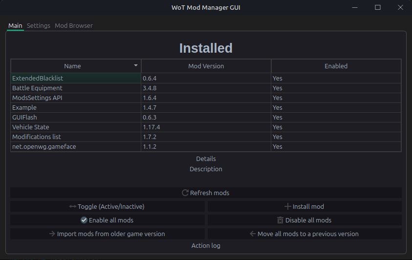
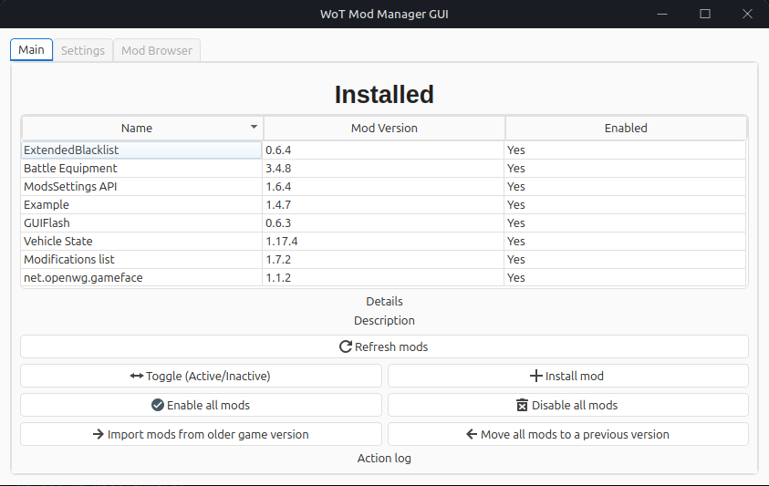
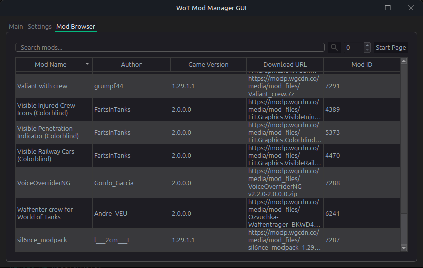
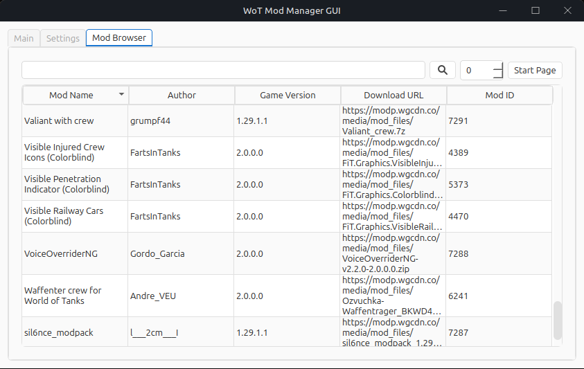

# WoT Mod Assistant
[](https://github.com/sam-k0/WoTModAssistantCore/actions/workflows/build_flatpak.yml)

A simple mod manager for World of Tanks.
*Developed primarily on Linux, with Windows support.*

### Compatibility
- Linux
- Windows (10+)

> [!IMPORTANT]
> As this tool is primarily developed on Linux, bugs and issues may arise on Windows.
> Please report any issues to the issue tracker.

MacOS/darwin is not currently supported.

### Features:
- Install, Uninstall mods
- Deactivate, Activate mods
- Import mods from previous game versions
- Choose which game version to import mods **to**
- Move mods between different game versions
- Persist your theme preference (Light/Dark)
- View mod information
- Browse `wgmods.net` for mods
- Drag and drop mod installation for `.wotmod` files
- Version control for mods
    - Example: If there's a dependency for two mods, and one of them is updated, the other will be automatically updated to the latest compatible version.

### Screenshots:
<br>
<div style="display: flex; justify-content: center;">
    <div style="margin: 5px;">
        
    </div>
    <div style="margin: 5px;">
        
    </div>
    <div style="margin: 5px;">
        
    </div>
    <div style="margin: 5px;">
        
    </div>
</div>

Planned features:
- [x] wgmods.net compatible mod browser integration:
    - [x] Mod listing
    - [x] Mod search by query
        - [x] Local cache can be searched
    - [x] .wotmod file download and install
    - [x] .zip file download and install
    - [ ] Modpack support
    - [ ] Mod update checking
- [ ] `res_mods` directory support
- [ ] Localization / language support
- [x] Styling and theming
    - [x] Persist theme preference across restarts

### Install
The recommended way to run the app is to use the Flatpak build.
As the app has not yet been submitted to Flathub, you will need to build it manually for now.

**Automatic releases:** Tagging a commit with a `v*` tag (e.g. `v1.0.0`) triggers a CI pipeline that builds the Flatpak bundle and publishes it as a GitHub release.
Install the latest release:
```bash
flatpak install --user --bundle WoTModAssistant.flatpak
```
Update an existing install:
```bash
flatpak update --user --reinstall --bundle WoTModAssistant.flatpak
```
The `WoTModAssistant.flatpak` bundle is attached to each release on the [releases](https://github.com/sam-k0/WoTModAssistantCore/releases) page.

- [Building](#building) — build a distributable executable directory with PyInstaller.
- [Running from source](#running-from-source) — run the app directly without building.
- [Manual Setup](#manual-setup) — point the app at your World of Tanks install.

## Running from source
The GUI is a pure Python + PySide6 application, so you can run it directly without building an executable.

1. Create a virtual environment (recommended):
   ```bash
   python3 -m venv .venv
   source .venv/bin/activate
   ```
2. Install dependencies:
   ```bash
   pip install -r ModManagerGUI/requirements-local.txt
   ```
3. Run the app from the `ModManagerGUI` directory:
   ```bash
   cd ModManagerGUI
   python3 main.py
   ```
   Or use the wrapper script: `./run.sh`

On first run you will be prompted to select your World of Tanks install directory — choose the folder containing `WorldOfTanks.exe`.

## Building
The project is built with PyInstaller into a single executable directory.
Linux, Windows and Flatpak build workflows are provided in `.github/workflows/` and can be triggered manually from the Actions tab.

### Building the GUI
1. Set up a virtual environment with Python 3.11:
   ```bash
   python -m venv .venv && source .venv/bin/activate
   ```
2. Install dependencies:
   ```bash
   pip install -r ModManagerGUI/requirements-local.txt
   ```
3. Build with PyInstaller from the `ModManagerGUI` directory:
   ```bash
   cd ModManagerGUI
   pyinstaller --name ModManagerGUI --windowed main.py
   ```
4. The built app is in `ModManagerGUI/dist/ModManagerGUI/`. Zip that directory for distribution.

> [!TIP]
> You can also execute the `build_linux.sh` script after setting up a venv with pyside6 and pyinstaller installed.
> Builds can be found in the [release](https://github.com/sam-k0/WoTModAssistantCore/releases) tab.

## Manual Setup
The app bundles everything it needs; there is no separate core executable to install.
You only need to point it at your World of Tanks installation.

1. Run the app (`python3 main.py` from `ModManagerGUI`, or run a built release).
2. On first run, select your World of Tanks install directory — the folder containing `WorldOfTanks.exe`.
   - On Windows you can find it via `WargamingGameCenter` → `World Of Tanks` → `Modify Installation` → `open game directory`.
3. The app will now list your installed mods. Your settings (including theme) are saved to `~/.config/wotmodassistant/config.json`.

## Dependencies
- PySide6, PyInstaller, Python 3.11 (`ModManagerGUI`)
- `modcore` is a pure-Python backend, so no separate C# core is required to run the GUI.

### Contributing

If you want to report bugs, request features or contribute to the project, please open an issue or a pull request.
Pull requests should be made to the `dev` branch. 
Also, please make sure your code follows `cross-platform` standards and is tested on both Windows and Linux.

> [!IMPORTANT]
> Please make sure to provide a detailed description of issues.
> If you are submitting a pull request, please make sure to provide a detailed description of the changes.
