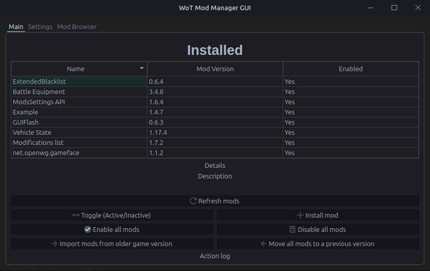
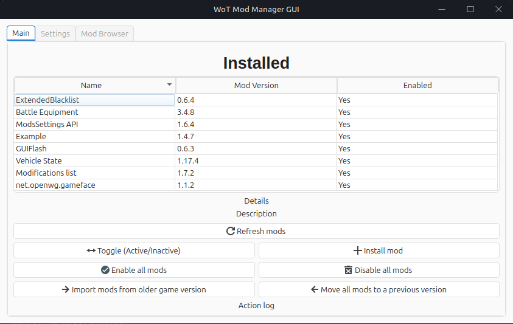
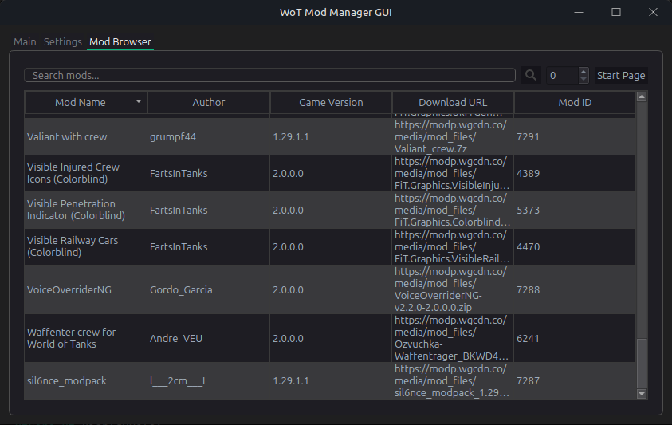
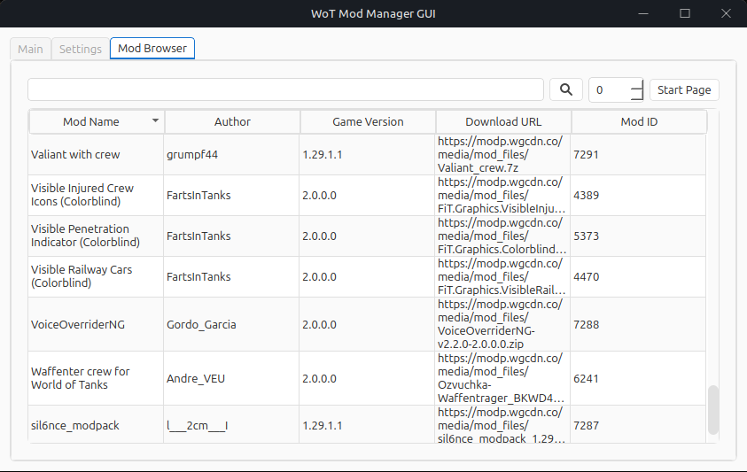

# WoT Mod Assistant
[](https://github.com/sam-k0/WoTModAssistantCore/actions/workflows/build_linux.yml) [](https://github.com/sam-k0/WoTModAssistantCore/actions/workflows/build_win.yml)

A simple cross-platform mod manager for World of Tanks.

### Compatibility
- Windows (10+)
- Linux 

> [!IMPORTANT]
> As this tool is primarily developed on Linux, bugs and issues may arise on Windows.
> Please report any issues to the issue tracker.

MacOS/darwin support is not planned but not explicitly impossible.

### Features:
- Install, Uninstall mods
- Deactivate, Activate mods
- Import mods from previous game versions
- Move mods between different game versions
- View mod information
- Browse `wgmods.net` for mods
- Drag and drop mod installation for `.wotmod` files
- Version control for mods
    - Example: If there's a dependency for two mods, and one of them is updated, the other will be automatically updated to the latest compatible version.

### Screenshots:
<br>
<div style="display: flex; justify-content: center;">
    <div style="margin: 5px;">
        
    </div>
    <div style="margin: 5px;">
        
    </div>
    <div style="margin: 5px;">
        
    </div>
    <div style="margin: 5px;">
        
    </div>
</div>

Planned features:
- [x] wgmods.net compatible mod browser integration:
    - [x] Mod listing
    - [x] Mod search by query
        - [x] Local cache can be searched
    - [x] .wotmod file download and install
    - [x] .zip file download and install
    - [ ] Modpack support
    - [ ] Mod update checking
- [ ] `res_mods` directory support
- [ ] Localization / language support
- [x] Styling and theming

### Install
To install, the recommended way is to use the flatpak.
As I have not yet submitted the app to flathub, you will need to install it manually for now.

#### Linux Fedora
- `sudo dnf install flatpak flatpak-builder git python3-pip`


#### Linux Debian/Ubuntu
- `sudo apt install flatpak flatpak-builder git python3-pip`

Then, continue with the following steps:

```bash
git clone https://github.com/sam-k0/WoTModAssistantCore.git
cd WoTModAssistantCore
git checkout flatpak
mkdir -p ModManagerGUI/wheels
pip wheel --wheel-dir=ModManagerGUI/wheels -r ModManagerGUI/requirements.txt
flatpak-builder --user --install --force-clean build-dir eu.samk0.WoTModAssistant.yaml
```

# Instructions below are for legacy version found in the releases tab.
As I am changing the whole project structure and code, there is no working release at the moment.

There will be a windows executable and linux flatpak or AppImage release.

## Installing
Following is an unfinished guide on how to install `ModManagerCore` and `ModManagerCoreGUI`.
> [!TIP]
> If you have trouble with automatic setup, please consult the `Manual Install`section of this readme.

### Linux

> [!TIP]
> You can also execute the `build_linux.sh` script after setting up a venv with pyside6 and pyinstaller installed.
> Also, builds can be found in the [release](https://github.com/sam-k0/WoTModAssistantCore/releases) tab.

1. Download or build the project.
2. Run `ModManagerGUI`.
3. It should prompt you to select your game directory.
4. Select the directory containing `WorldOfTanks.exe`


### Windows
> [!TIP]
> Please download the latest `Windows release` build from the [release](https://github.com/sam-k0/WoTModAssistantCore/releases) tab.

1. Download and unzip the latest release.
2. Run `ModManagerGUI.exe`.
3. On first run, it will prompt you to select the game directory, you can find it by checking the `WargamingGameCenter`->`World Of Tanks`->`Modify Installation`->`open game directory`.
4. Select the path to `WorldOfTanks.exe`.

## Manual Install & Setup

### Linux
1. Create a new directory `wotmodmanager`, and a directory called `Core` inside it.
2. Build or install the `ModManagerCore` to the newly created `wotmodmanager/Core` directory.
3. Install the CoreGUI in the parent folder, so that the `Core` directory one directory deeper as the `CoreGUI` executable.
4. Important step: Run the `ModManagerCore` executable, it will prompt you to enter your World of Tanks install directory path. This means the directory where `WorldOfTanks.exe` resides.
5. Now, run the `CoreGUI` and you should see it automatically listing mods.

### Windows
1. Download the `.zip` archive and extract.
2. Inside it, find the `_internal/Core` folder.
3. Run `ModManagerCore.exe` and set up your World Of Tanks install path (the directory where `WorldOfTanks.exe` resides.)
4. Run the `CoreGUI` from the main directory.

## Dependencies
- PySide6, PyInstaller, Python 3.11x `(ModManagerCoreGUI)`
- Newtonsoft.Json, .NET 8.0 `(ModManagerCore)`

Please check the project's subdirectories readme files for more information on how to build.

### Contributing

If you want to report bugs, request features or contribute to the project, please open an issue or a pull request.
Pull requests should be made to the `dev` branch. 
Also, please make sure your code follows `cross-platform` standards and is tested on both Windows and Linux.

> [!IMPORTANT]
> Please make sure to provide a detailed description of issues.
> If you are submitting a pull request, please make sure to provide a detailed description of the changes.
